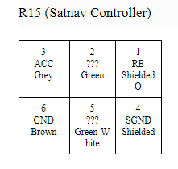
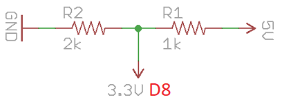

# LexusNavController

An Arduino library to interface with the **Lexus IS200 / IS300 / Toyota Altezza XE10 Navigation Controller** (model years 1998–2005).  

**Note:** Download the NicoHood's HID library to ensure 100% compatibility: https://github.com/NicoHood/HID

---

## Overview  

The Lexus/Toyota Navigation Remote Controller is located in the center console and was originally designed to operate the OEM GPS navigation system.  
However, the OEM navigation system is now obsolete and often replaced by modern Android head units — which leaves the remote controller unused once the OEM navigation system is removed.  

Since there is no public documentation (it is not AVC-LAN nor BEAN MPX), this project was born from **reverse engineering** the controller through trial and error.  

The research revealed that the device behaves as a simple **unidirectional UART transmitter** at **2400 baud, 5V TTL logic**, which makes it fully compatible with most Arduino boards (Uno, Mega, Nano, etc.).  
With a simple voltage divider, it also works with 3.3V microcontrollers (ESP32, Arduino Pro Micro, etc.).  

---

## Features  

- Decode button presses from the Lexus/Toyota Nav Controller.  
- Lightweight API for simple integration (`if(nav.press == LNR_BTN_MAP) { ... }`).  
- Known button patterns stored separately (easy to extend).
- 4 Examples included.
- Supports Keyboard, Mouse and Joysitck emulation (Thanks to NicoHood's HID Library) 

---

## Pinout (R15 – Satnav Controller)  

  

| Pin | Wire Color   | Voltage   | Description |
|-----|--------------|-----------|-------------|
| 1   | Orange       | +5V       | TX signal from Nav Controller (RE) |
| 2   | Green        | +12V      | Illumination + (Ill+) |
| 3   | Grey         | +12V      | ACC (switched +12V supply) |
| 4   | Black/Tape   | –5V       | Signal ground for TX (SGND) — *not used* |
| 5   | Green-White  | –12V      | Illumination ground (Ill–) — *not used* |
| 6   | Brown        | –12V/–5V  | Device ground (connect to Arduino GND) |

⚠️ **Note:** Signals at +5V/–5V can also be handled as +3.3V/–3.3V if using a 3.3V MCU, but always use a regulator or voltage divider.  

---

## Arduino Wiring Example (Arduino UNO)  

| Arduino Pin | Nav Controller Pin |
|-------------|---------------------|
| D8          | 1 (TX – RE) |
| GND         | 6 (Ground) |

---

### Voltage Divider: 5V → 3.3V  

If you are using a 3.3V MCU (e.g. ESP32, Arduino Pro Micro), you should reduce the 5V TX signal from the Nav Controller to 3.3V.  
This can be achieved with a simple resistor divider.  

**Required components:**  
- 1 × 1 kΩ resistor  
- 1 × 2 kΩ resistor  
- Jumper wires  

**Wiring schematic:**  

  

Connect the resistors as shown:  
- The **5V signal** from the Nav Controller goes into **R1 (1 kΩ)**.  
- The junction between **R1** and **R2 (2 kΩ)** is connected to the Arduino/ESP32 RX pin (e.g. **D8**).  
- **R2** is tied to **GND**.  
- This reduces the voltage safely to around **3.3V**.  

---

## Getting Started  

1. Clone or download this repository.  
2. Copy the `LexusNavController` folder into your `Arduino/libraries/` directory.  
3. Restart the Arduino IDE.  
4. Open the included **examples** (File → Examples → LexusNavController).  
5. Upload and test — button presses will now be decoded and available in your sketch.  

---

## Roadmap  

- [x] Basic decoding of known button patterns.  
- [x] Example sketches (button check, sniffer).  
- [x] Add support for dynamic/custom patterns.  
- [ ] Add support for IR (wireless) Nav Controller.  
- [ ] Full documentation of all button codes.  
- [ ] Publish to Arduino Library Manager.  

---

## Demo Video  

---

## Motivation  

This is my very first public electronics + reverse engineering project.  
I am not a professional engineer — just a car enthusiast and DIY tinkerer who wanted to give new life to the Lexus/Toyota Navigation Remote Controller.  

With this library, you can:  
- Decode button presses from the Nav Controller.  
- Integrate the controller into custom projects (e.g. Android head units, CAN bus bridges, custom dashboards).  
- Extend it with your own patterns and key mappings.  

---

## License  

MIT License — see [LICENSE](LICENSE).  

